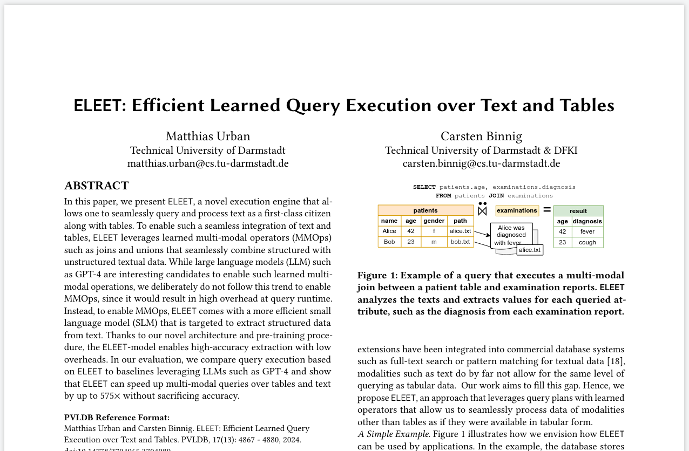

# ELEET: Efficient Learned Query Execution over Text and Tables

ELEET is an Execution Engine to run multi-modal queries over datasets containing texts and tables.
This is the implementation described in

> Matthias Urban and Carsten Binnig: "ELEET: Efficient Learned Query Execution over Text and Tables.", PVLDB, 17(13): 4867-4880, 2024. [PDF](https://www.vldb.org/pvldb/vol17/p4867-urban.pdf)
>
> 

## Project Structure

- Code regarding Pre-training (i.e. corpus construction and pre-training scripts) is located in "eleet_pretrain"
- Code for everything else (e.g. query plans, MMOps, baselines, benchmark) is located in "eleet".
- Some scripts are located in "scripts" and "slurm" as described below.

### Setup

> :warning: Due to some issues regarding outdated dependencies, we are currently working on updating the codebase to work with the latest versions of the libraries.

Install ELEET and all necessary requirements.

```sh
git clone git@github.com:DataManagementLab/eleet.git  # clone repo
cd eleet
git submodule update --init
conda env create -f environment.yml  # setup environment
conda activate eleet
pip install git+https://github.com/meta-llama/llama.git@llama_v2  # install LLaMA
pip install -e .
cd TaBERT/ && pip install -e . && cd ..  # install TaBERT
python -m spacy download en_core_web_sm
```

### Download pre-trained model and datasets

```sh
gdown 1JIvXC0ajRZRCENMlLD3En7SGoodjP6O3
tar -xzvf pretrained-model.tar.gz
gdown 1hFCwdf8CIWDpE3KdHVfT8uQVrpE1Bv1c
tar -xzvf datasets.tar.gz
```

### Finetuning + Evaluation

1. Run finetuning: ```sbatch slurm/rotowire/train-ours.slurm``` (Repeat for other datasets and models).
    --> Will store finetuned model in models/rotowire/ours/finetuned
1. Mark finetuned model to be used:

    ```sh
    cd models/rotowire/ours/finetuned
    ln -s <git-commit-hash_git-commit-msg>/<YYYY-MM-DD_hh-mm-ss...> current  # adapt to the output dir that was created on your machine
    cd ../../../../
    ```

1. Run evaluation (Exp 1): ```python eleet/benchmark.py --slurm-mode --use-test-set --split-sizes 64```
1. Run evaluation (Exp 2+3): ```python eleet/benchmark.py --slurm-mode --use-test-set --only-flagged```
1. Visualize results using Jupyter notebooks located in ```scripts/*.ipynb```

### Pre-Training and generation of datasets

1. You can download the pre-training dataset [here](https://drive.google.com/file/d/11D-iSwaOMVwQn20NnD81GRwMjMhMX3ma/view?usp=drive_link)

Alternatively, you can also generate the pre-training dataset from Wikidata:

1. Run MongoDB and set environment variables (MONGO_USER, MONGO_PASSWORD, MONGO_HOST, MONGO_PORT, MONGO_DB)
    <https://www.mongodb.com/docs/manual/tutorial/install-mongodb-on-ubuntu/>
1. Start data pre-processing: python scripts/load_data.py trex-wikidata
    --> preprocessed data will appear in datasets/preprocessed_data/preprocessed_trex-wikidata*
1. Use slurm/pretrain.slurm for pre-training (Adjust path in file first to point to pre-training dataset).
    --> Will store pretrained model in models/pretrained
1. Generate TREx Dataset: ```python eleet/datasets/trex/generate.py```
1. Generate Rotowire Dataset: ```python eleet/datasets/rotowire/generate.py```

## Reference

If you use code or the benchmarks of this repository then please cite our paper:

```bib
@inproceedings{eleet,
  title={ELEET: Efficient Learned query Execution over Text and Tables},
  author = {Matthias Urban and Carsten Binnig},
  journal={Proceedings of the VLDB Endowment},
  volume={17},
  number={13},
  pages={4867--4880},
  year={2024},
  publisher={VLDB Endowment}
}
```
